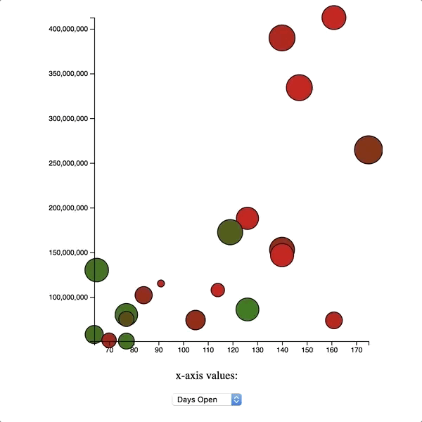

# Introduction to D3

`d3` is a powerful JavaScript library that allows us to build tie together documents and data (the 3 d's in `d3` stand for data-driven documents). The syntax can look a bit strange at first, but there are only a few key concepts you need to know before you can start working with `d3`.

### Objectives

By the end of this tutorial, you should be able to:

- Bind data to elements (including elements that aren't on the page yet!)
- Append new elements in the page that are tied to data
- Scale your data to fit on the page
- Create a scatterplot using `d3`

### The Goal

In this tutorial, we'll work on building a graph of data involving movies that were released in the summer of 2016. Here's an image showcasing the functionality:



Each dot on the graph represents a single movie. Here are some of the important features of the graph:

1. The color of each dot corresponds to its quality (as measured by its Rotten Tomatoes freshness score)
2. The size of each point represents the [multiplier](http://www.the-numbers.com/glossary.php) for the film. A film's multiplier is its total gross divided by its opening weekend gross; the higher the multiplier (i.e. the larger the dot), the greater its longevity. 
2. The vertical placement of the point corresponds to how much money the film made (in millions of dollars).
3. By default, the horizontal placement of the dot corresponds to how long the film was in theaters (in days). 
4. All data is scaled so that it fits in the graph space.
5. There are horizontal and vertical axes to help label the data. (**Note:** we won't cover this, we'll leave it as a bonus).
6. Hovering over a dot reveals the film it represents. (**Note:** we won't cover this, we'll leave it as a bonus).
7. You can change the x-axis values of the dots using a dropdown (**Note:** we won't cover this, we'll leave it as a bonus).
8. When you update the x-axis, the dots transition smoothly (**Note:** we won't cover this, we'll leave it as a bonus).

That's a lot of functionality to cover, so let's get to it!

### Introduction: Adding data to the document

Before we can start building anything with `d3`, we need to first understand how to use `d3` to add data-rich elements to a page.

To begin, let's open up the `index.html` page in Google Chrome. The starter HTML code looks like this:

```html
<!DOCTYPE html>
<html lang="en">
<head>
  <meta charset="UTF-8">
  <title>Document</title>
  <style>
    body {
      text-align: center;
    }
  </style>
</head>
<body>
  <svg></svg>
  <script src="https://d3js.org/d3.v4.min.js"></script>
  <script src="movies.js"></script>
  <script src="app.js"></script>
</body>
</html>
```

(Notice that at the bottom, we're including `d3` along with a couple other JavaScript files. More on that later.)

Once you've opened up the page in Chrome, hit `Command + Shift + J` (on a Mac) to open up the Chrome console. Since we've loaded `d3`, we should have access to it on the page! Try this out by typing `d3` in the console and hitting enter. You should see the following:

```js
Object {event: null, version: "4.3.0", symbols: Array[7], symbolCircle: Object, symbolCross: Object…}
```

So, how can we use `d3` to bind data to elements on the page? Let's take a look at a quick example.

To start, let's create an array in the JavaScript console.

```js
var quotes = [
	"Go ahead, make my day.",
	"I'll be back.",
	"May the Force be with you.",
	"There's no place like home.",
	"You're gonna need a bigger boat."
];
```

Now let's add these quotes to the page. Here's one way you could do that in `d3`:

```js
d3.select("body")
  .selectAll("p")
  .data(quotes)
  .enter()
  .append("p")
  .text(function(d) {
    return d;
  });
```

Put this code in the console and you should see the text appear on the page!

Woah. What just happened? There's a lot to unpack here, so let's go through it line by line.

We're first selecting the `body` tag in HTML using `d3`. Similar to `jQuery` or even vanilla JavaScript, it's possible to select and manipulate elements on the page using `d3`. We need to select the `body` because our goal is to create a paragraph tag for each quote.

After we select the `body` tag we call `.selectAll("p")` on the selection. This seems like a strange thing to do; after all, there aren't any `p` tags on the page! Shouldn't this result in some kind of empty selection, or maybe even `null`?

While the syntax may look strange, this is a very common pattern in `d3`. You can think of the expression 

```js
d3.select("body")
  .selectAll("p")
```

as a sort of placeholder for the paragraph tags that we're about to create.

The next line is where the binding takes place. The `data` method is probably the most important method in all of `d3`. The `data` method is responsible for _joining_ an array of data to a collection of elements in the document (in this case, a collection of HTML `p` tags).

In the event that there's more data in the array than elements on the page, `d3` creates what's called an `enter` selection. As described in the `d3` [docs](https://github.com/d3/d3-selection/blob/master/README.md#selection_enter), the enter selection is essentially a "placeholder nodes for each datum that had no corresponding DOM element in the selection," and "is typically used to create 'missing' elements corresponding to new data." To access this selection, we call the `enter` method. We can then append these nodes into our document. 

This is what's happening in the next line, when we call `.append("p")`. We are taking our selection of elements bound to our quote data, and appending them to the page. 

The last thing we do is call the `text` method. What's going on here? It seems that we're passing a function into this method, which takes a parameter `d`. This is another common `d3` pattern: in this instance, passing in a function to `text` has the effect of running that function on every item in the array of data. In the above example, the function doesn't too much: it just returns the current quote (represented by the variable `d`). What happens if you `return d[0]` instead? Or `d.toUpperCase()`?

Here's another example. Suppose our array of quotes looks like this:

```js
var quotes = [{
	quote: "Go ahead, make my day.",
	color: "red"
}, {
	quote: "I'll be back.",
	color: "orange"
}, {
	quote: "May the Force be with you.",
	color: "yellow"
}, {
	quote: "There's no place like home.",
	color: "green"
}, {
	quote: "You're gonna need a bigger boat.",
	color: "blue"
}];
```

We can then append these quotes to the page and account for their colors like so:

```js
d3.select("body")
  .selectAll("p")
  .data(quotes)
  .enter()
  .append("p")
  .text(function(d) {
    return d.quote;
  })
  .style('color', function(d) {
    return d.color;
  });
```

Just like we can manipulate the text itself using the bound data, we can also manipulate css properties!

Note that you can always see what data is bound to an element by accessing the element's `__data__` property, which is set by `d3`. If you've got quotes with different colors on the page, you should be able to reproduce the following:  

```js
var firstQuote = document.querySelector("p");
firstQuote.__data__; // Object {quote: "Go ahead, make my day.", color: "red"}
```

This isn't how you should access bound data, it's just an example of how `d3`s internals are working.

#### Exercise

Append five quotes on the page so that each one has a different font size (the details of how you implement this are up to you!)

## SVG

SVG (short for Scalable Vector Graphics) is a way for us to draw images in the DOM. The use of vector graphics means that the images don't degrade in quality as you resize them (for more on vector graphics, Wikipedia offers a [nice starting point](https://en.wikipedia.org/wiki/Vector_graphics)). The [MDN docs](https://developer.mozilla.org/en-US/docs/Web/SVG) perhaps summarize it best: "SVG is essentially to graphics what HTML is to text.

Important SVG elements that we'll be using:

__circle__

<svg height="220" width="220">
<circle
  cx=110
  cy=110
  r=100
  stroke="#ff0000"
  stroke-width="4"
  fill='#0000ff'/>
 </svg>

```
<svg height="220" width="220">
  <circle
   cx=110
   cy=110
   r=100
   stroke="#ff0000"
   stroke-width="4"
   fill='#0000ff'/>
 </svg>
```

__rect__


<svg height="200" width="200">
<rect
  x=0
  y=0
  width=200
  height=200
  fill="#ffffff"
  stroke="#000000"
  stroke-width="4" />
</svg>


```
<svg height="200" width="200">
<rect
  x=0
  y=0
  width=200
  height=200
  fill="#ffffff"
  stroke="#000000"
  stroke-width="4" />
</svg>
```

__rect__ (rounded corners)

<svg height="215" width="210">
<rect
  x=5
  y=5
  rx=35
  ry=35
  width=200
  height=200
  fill="#15Cf2A"
  stroke="#000000"
  stroke-width="4" />
</svg>


```
<svg height="215" width="210">
<rect
  x=5
  y=5
  rx=35
  ry=35
  width=200
  height=200
  fill="#15Cf2A"
  stroke="#000000"
  stroke-width="4" />
</svg>
```

__path__

<svg height="175" width="350">
<path
  d="M160 5 L5 155 L310 150Z"
  fill="rgb(10,180,190)"
  stroke-width="5"
  stroke="black" />
</svg>

```
<svg height="175" width="350">
<path
  d="M160 5 L5 155 L310 150Z"
  fill="rgb(0,255,0)"
  stroke-width="5"
  stroke="black" />
</svg>
```

__g__ (group)

The _g_ element is used to group other svg elements:

<svg height="250" width="300">
  <g stroke="black" stroke-width="3">
    <circle cx=55 cy=55 r=50 fill="#006BB6"/>
    <rect x=100 y=100 width=100 height=100 fill="#FDB927"/>
  </g>
</svg>

```
<svg height="250" width="300">
  <g stroke="black" stroke-width="3">
    <circle cx=55 cy=55 r=50 fill="#006BB6"/>
    <rect x=100 y=100 width=100 height=100 fill="#FDB927"/>
  </g>
</svg>
```


__EXERCISE 2__

Create an svg that has a triangle inside of a square inside of a circle.  Put all of those elements in a group with some shared properties on the group:


<svg height="230" width="250">
  <g stroke="black" stroke-width="1">
    <circle cx=110 cy=110 r=100 fill="#006BB6"/>
    <rect x=60 y=60 width=100 height=100 fill="#FDB927"/>
        <path
  d="M80 150 L80 80 L150 150Z"
  fill="rgb(0,255,0)"
  stroke="black" />
  </g>
</svg>


For more information on SVGs, check out the [MDN docs](https://developer.mozilla.org/en-US/docs/Web/SVG).

### Plotting Points to SVG: Attributes and Scales

While you can absolutely use `d3` to manipulate HTML directly, when it comes to graphing, it's more common to see `d3` used to manipulate SVG elements. (This isn't a lesson on SVG, but if you'd like to learn more about the format, check the [MDN docs](https://developer.mozilla.org/en-US/docs/Web/SVG).)

The HTML file we're working with already has an svg on it. Let's add some data to it.

There are different shapes and paths you can add to an svg, but for our present purposes we'll only need to know how to add circles. To define a circle, we need three numbers: two for its position, and one for its radius. These three numbers are represented in svg by three attributes: `cx`, `cy`, and `r`.

Let's open up our `app.js` and write some JavaScript. First we'll change the default dimensions of the svg on the page, and then we'll add our first circle to the svg.

```js
var width = 500;
var height = 500;
var svg = d3.select("svg")
            .attr("width", width)
            .attr("height", height);

var data = [[250, 250]];

svg.selectAll('circle')
  .data(data)
  .enter()
  .append('circle')
  .attr('cx', function(d) { return d[0]; })
  .attr('cy', function(d) { return d[1]; })
  .attr('r', function() { return 10; });
```

If you refresh the page, you should see a black dot in the center of the svg! By default, the dots will have a black fill (we'll learn how to customize this later).

Let's add some more coordinates to the `data` array. 

```js
var data = [[250, 250], [0, 0], [100, 150], [400, 200], [700, 250]];
```

When you refresh the page, there may be a few things that surprise you. Here are some things to observe:

1. The point at (0, 0) corresponds to the _upper_-left corner of the svg, not the _lower_-left, as it usually does when you set up coordinates in math class. Values increase from left to right horizontally, but from top to bottom vertically. 
2. Just because the center of the dot fits in the svg, doesn't mean the entire dot will. For example, the dot at (0, 0) gets cropped by the edges of the svg so that you only see part of it.
3. If the center of the dot is outside the bounds of the svg, it may not show up at all! Notice that there are five elements in the `data` array, but only four dots appearing on the svg. The dot with a `cx` value of `700` sits outside the bounds of the svg and isn't visible.

Of all of these problems, the third one is the biggest. Very often you'll have data that exists over a large range of numbers, but you'll want to fit them into a reasonably-sized svg. In cases like this, what you'd like to have is a way to scale your data to a more reasonable size.

Don't worry, `d3`s got your back. It comes equipped with a variety of [scale](https://github.com/d3/d3/blob/master/API.md#scales-d3-scale) methods that will fit your data to the viewable area.

To specify a scale, you need to specify a domain and a range. `d3` will then take care of mapping points in the domain to points in the range. For example, for the data set above, we could create an _x_ scale and a _y_ scale as follows:

```js
var xScale = d3.scaleLinear()
               .domain([0, 1000])
               .range([0, width]);

var yScale = d3.scaleLinear()
               .domain([0, 500])
               .range([height, 0]);  
```

Note that `xScale` maps `[0, 1000]` to `[0, width]`, but `yScale` maps `[0, 500]` to `[height, 0`]; in particular, 0 gets mapped to 0 for the `x` scale, but to `height` for the `y` scale. This has the effect of flipping the coordinates so that (0, 0) is in the lower-left corner of the svg, which is the common orientation in math and makes plotting points a bit more straightforward.

One you've set up the scales, you'll also need to be sure to use them when you plot the points. Next we need to modify the `cx` and `cy` attributes:

```js
svg.selectAll('circle')
  .data(data)
  .enter()
  .append('circle')
  .attr('cx', function(d) { return xScale(d[0]); })
  .attr('cy', function(d) { return yScale(d[1]); })
  .attr('r', function() { return 10; });
```

Notice that with these adjustments, all five points are visible on the svg. However, we're assuming that all points will have an x coordinate between 0 and 1000, and a y coordinate between 0 and 500. This may not be true, especially if we're planning on adding data later on. A better approach would be to base the domains on the max and min of our data set. Thankfully, `d3` has us covered here too: it has built-in max and min functions. So we can rewrite our scales as follows:

```js
var xMin = d3.min(data, function(d) {
  return d[0];
});

var xMax = d3.max(data, function(d) {
  return d[0];
});

var yMin = d3.min(data, function(d) {
  return d[1];
});

var yMax = d3.max(data, function(d) {
  return d[1];
});

var xScale = d3.scaleLinear()
               .domain([xMin, xMax])
               .range([0, width]);

var yScale = d3.scaleLinear()
               .domain([yMin, yMax])
               .range([height, 0]);  
```

As a result of this change, however, even more points get cut off from the edge of the svg. To fix this, we can introduce some padding to the scale:

```js
var padding = 10;

var xScale = d3.scaleLinear()
               .domain([xMin, xMax])
               .range([padding, width - padding]);

var yScale = d3.scaleLinear()
               .domain([yMin, yMax])
               .range([height - padding, padding]); 
```

Things should look better now. Let's explore some more interesting data.

### Plotting Our Movie Data

As you may have already noticed, we've got a second JavaScript file with data on movies released in the summer of 2016. Let's explore this data; we've already got the building blocks to create some visualizations.

To begin, let's replace our array of coordinates by just setting `data` equal to the `movies` array from the other JavaScript file:

```js
var data = movies;
```

Next, we need to decide what we want to plot. for now, let's plot total earnings on the y axis, and days open on the x axis. This means we need to update our code to reference these two properties: 

```js
var xMin = d3.min(data, function(d) {
  return d.daysOpen;
});

var xMax = d3.max(data, function(d) {
  return d.daysOpen;
});

var yMin = d3.min(data, function(d) {
  return d.total;
});

var yMax = d3.max(data, function(d) {
  return d.total;
});

var padding = 10;

var xScale = d3.scaleLinear()
               .domain([xMin, xMax])
               .range([padding, width - padding]);

var yScale = d3.scaleLinear()
               .domain([yMin, yMax])
               .range([height - padding, padding]);               

svg.selectAll('circle')
  .data(data)
  .enter()
  .append('circle')
  .attr('cx', function(d) { return xScale(d.daysOpen); })
  .attr('cy', function(d) { return yScale(d.total); })
  .attr('r', function() { return 10; });
```

So far so good. Now let's adjust the color of each dot based on its freshness. We can actually do this by creating another scale!

```js
var colorScale = d3.scaleLinear()
                   .domain([0,1])
                   .range(['red', 'green']);
                   
svg.selectAll('circle')
  .data(data)
  .enter()
  .append('circle')
  .attr('cx', function(d) { return xScale(d.daysOpen); })
  .attr('cy', function(d) { return yScale(d.total); })
  .attr('r', function() { return 10; })
  .attr('fill', function(d) { return colorScale(d.freshness); })
  .attr('stroke', 'black');
```

Our color scale converts freshness ratings to colors: a movie with 0% freshness will be red, a movie with 100% freshness will be green, and anything in between will be colored accordingly. The `fill` attribute determines the color of the circle, while the `stroke` attribute determines the color of its outline.

Next, let's dynamically adjust the radius. In the original GIF, the radius was proportional to a film's total, divided by its opening weekend total. So let's change the line impacting the `r` attribute as follows:

```js
	.attr('r', function(d) { return 5 * d.total / d.openingTotal; })
```

You may also need to adjust the padding variable.

### Next Steps

There are still quite a few features missing from the graph you have compared to the graph in the GIF. But now is a good time to research `d3` on your own and try to implement some features yourself. Here are some tips:

* For the axes, look into `d3`'s built-in [axes helpers](https://github.com/d3/d3/blob/master/API.md#axes-d3-axis).
* For the hovering, look into `d3`'s `on` method. Before trying to replicate the functionality in the image, try to make it so that when you hover over a dot, the title of the movie represented by the dot gets logged to the console.
* For transitions, look into `d3` [transitions](https://github.com/d3/d3-transition).
* Breathe and have fun.
